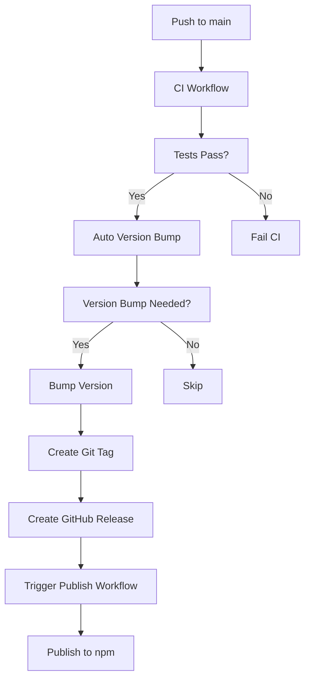

# Version Management Guide

This guide explains how to manage versions and releases for the CostLens SDK using GitHub Actions.

## 🚀 Available Workflows

### 1. **Manual Version Bump** (`version-bump.yml`)
**Trigger:** Manual workflow dispatch
**Use Case:** When you want full control over version bumping

```bash
# How to use:
1. Go to Actions → Version Bump → Run workflow
2. Select version type: patch, minor, or major
3. Workflow will:
   - Bump version in package.json
   - Create git tag
   - Push changes
   - Generate comprehensive release notes
   - Create GitHub release
   - Trigger publish workflow
```

### 2. **Release Notes Generator** (`generate-release-notes.yml`) ⭐ **NEW**
**Trigger:** Manual workflow dispatch or push to main
**Use Case:** Generate beautiful, categorized release notes

```bash
# How to use:
1. Go to Actions → Generate Release Notes → Run workflow
2. Optionally specify version to generate notes for
3. Workflow will:
   - Analyze commits since last tag
   - Categorize changes (features, fixes, breaking, etc.)
   - Generate comprehensive release notes
   - Save as artifact and RELEASE_NOTES.md
```

### 2. **Auto Version Bump** (`auto-version.yml`) ⭐ **NEW**
**Trigger:** Push to main branch OR manual dispatch
**Use Case:** Automatic version bumping based on commit messages

```bash
# How it works:
- Analyzes commits since last tag
- Detects version bump type based on conventional commits
- Automatically bumps version and creates release

# Commit message patterns:
feat: new feature          → minor bump
fix: bug fix              → patch bump
feat!: breaking change    → major bump
BREAKING CHANGE:          → major bump
```

### 3. **Enhanced CI with Version Detection** (`ci.yml`)
**Trigger:** Push/PR to main/develop
**Use Case:** Detects version bump commits and triggers version-bump workflow

```bash
# Commit message patterns that trigger version bump:
feat: new feature         → minor bump
fix: bug fix             → patch bump
feature: major change    → major bump
```

## 📋 Version Bump Types

| Type | When to Use | Example |
|------|-------------|---------|
| **patch** | Bug fixes, small improvements | `fix: resolve memory leak in cache` |
| **minor** | New features, enhancements | `feat: add load testing utilities` |
| **major** | Breaking changes, major rewrites | `feat!: redesign API interface` |

## 🔄 Complete Release Flow

### Option A: Automatic (Recommended)
```bash
# 1. Make changes and commit with conventional commit message
git add .
git commit -m "feat: add comprehensive load testing"
git push origin main

# 2. Auto-version workflow will:
#    - Detect "feat:" → minor bump
#    - Bump version (e.g., 1.1.2 → 1.2.0)
#    - Create git tag (v1.2.0)
#    - Create GitHub release
#    - Trigger publish workflow
#    - Publish to npm
```

### Option B: Manual Control
```bash
# 1. Make changes and commit
git add .
git commit -m "fix: resolve test timeout issues"
git push origin main

# 2. Go to Actions → Version Bump → Run workflow
# 3. Select "patch" for bug fixes
# 4. Workflow handles the rest
```

### Option C: Force Specific Version
```bash
# 1. Go to Actions → Auto Version Bump → Run workflow
# 2. Enter specific version (e.g., "2.0.0")
# 3. Workflow will bump to that exact version
```

## 🛠️ Workflow Dependencies



## 🛠️ Release Notes Script

### **Local Release Notes Generation**
```bash
# Generate release notes for current version
npm run release-notes

# Generate release notes for specific version
npm run release-notes:version 2.0.0

# Generate release notes comparing specific tags
node scripts/generate-release-notes.js 2.0.0 v1.9.0
```

### **Features:**
- **Conventional Commits** analysis and categorization
- **Automatic categorization** (features, fixes, breaking, docs, tests, etc.)
- **Beautiful formatting** with emojis and tables
- **Release type detection** (major/minor/patch)
- **Installation instructions** and links
- **Contributor recognition**

## 📊 Current Workflow Status

| Workflow | Status | Trigger | Purpose |
|----------|--------|---------|---------|
| `ci.yml` | ✅ Active | Push/PR | Test, build, lint + version detection |
| `version-bump.yml` | ✅ Active | Manual | Manual version bump |
| `publish.yml` | ✅ Active | Release/Manual | Publish to npm |
| `auto-version.yml` | ✅ Active | Push/Manual | Auto version bump + release notes |
| `generate-release-notes.yml` | ✅ Active | Manual/Push | Generate release notes |

## 🎯 Best Practices

### Commit Message Format
```bash
# Use conventional commits for automatic version detection
type(scope): description

# Examples:
feat: add load testing utilities
fix: resolve memory leak in cache
feat!: redesign API interface
docs: update README with examples
test: add comprehensive test coverage
```

### Version Bump Strategy
- **patch**: Bug fixes, documentation updates, test improvements
- **minor**: New features, new utilities, non-breaking enhancements
- **major**: Breaking changes, major API redesigns, major rewrites

### Release Process
1. **Development**: Work on feature branch
2. **Testing**: Ensure all tests pass
3. **Commit**: Use conventional commit messages
4. **Push**: Push to main branch
5. **Automation**: Let workflows handle version bump and publishing
6. **Verification**: Check npm and GitHub for new release

## 🔧 Troubleshooting

### Version Bump Not Triggered
- Check commit message follows conventional format
- Ensure push is to main branch
- Check workflow logs for errors

### Manual Override
- Use manual workflow dispatch
- Specify exact version if needed
- Check for existing tags/versions

### Publish Issues
- Verify NPM_TOKEN secret is set
- Check if package version already exists
- Review publish workflow logs

## 📈 Monitoring

- **GitHub Actions**: Check workflow runs and logs
- **npm**: Verify package versions and downloads
- **GitHub Releases**: Review release notes and tags
- **Package.json**: Confirm version updates

---

**Need help?** Check the workflow logs in GitHub Actions or review this documentation.
